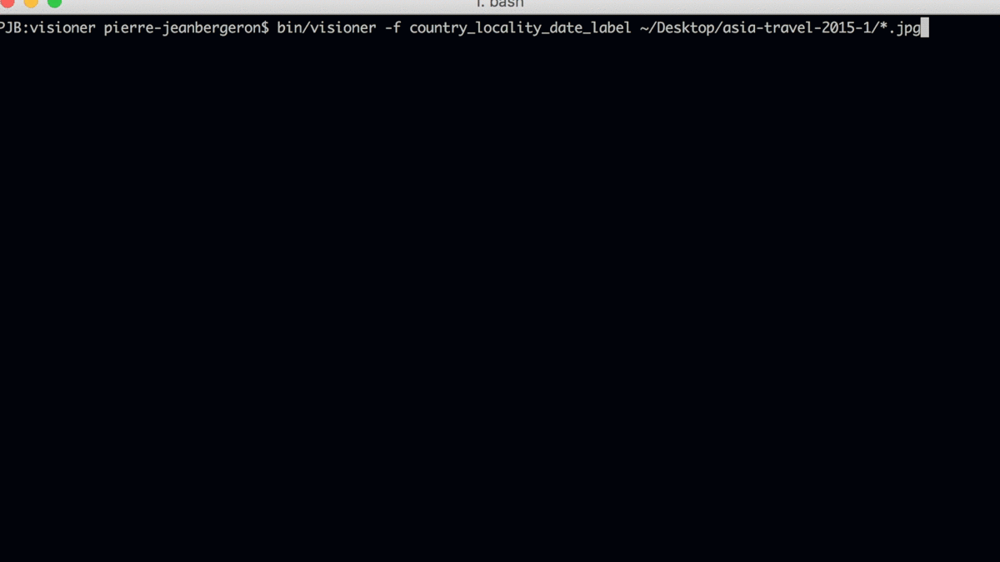

# Visioner

Automatically rename your pictures using Google Vision API and metadata.

## Installation

    $ bundle install
    $ rake install

## Usage

*This application is still under development. Please, make a copy of your pictures before using Visioner.*

    $ export GOOGLE_API_KEY=...
    $ bin/visioner [options] image ...

**Options:**

- -f, --format FORMAT              Desired format for the new filenames
- -h, --help                       Displays help

**Format directives:**

- label - uses google vision API to find a label
- locality - uses metadata to find the locality / city
- country - uses metadata to find the country
- date - uses metadata to find the original date
   
**Format example:** `date_country_label`

### Examples:

    $ export GOOGLE_API_KEY=BI34SyB5DhqV5ReVnkmIM79812yux9UFazNdynD

    $ bin/visioner --format label /Desktop/travel-south-korea-2016/*.jpg
      /Desktop/travel-south-korea-2016/IMG_213.jpg -> sea.jpg
      /Desktop/travel-south-korea-2016/IMG_214.jpg -> tower.jpg
      /Desktop/travel-south-korea-2016/IMG_215.jpg -> people.jpg
      /Desktop/travel-south-korea-2016/IMG_216.jpg -> sea2.jpg

    $ bin/visioner --format country_locality_date_label /Desktop/travel-south-korea-2016-2/*.jpg
      /Desktop/travel-south-korea-2016-2/IMG_213.jpg -> south-korea_seoul_02-28-2015_sea.jpg
      /Desktop/travel-south-korea-2016-2/IMG_214.jpg -> south-korea_seoul_03-15-2015_tower.jpg
      /Desktop/travel-south-korea-2016-2/IMG_215.jpg -> south-korea_seoul_03-28-2015_people.jpg
      /Desktop/travel-south-korea-2016-2/IMG_216.jpg -> south-korea_seoul_04-02-2015_sea2.jpg

